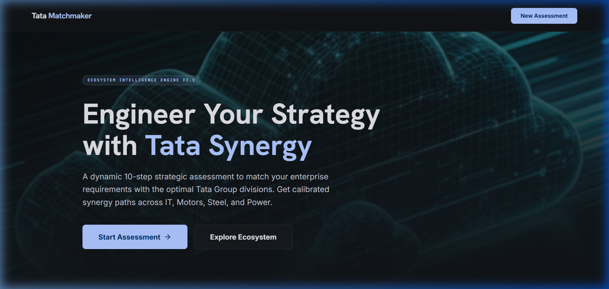
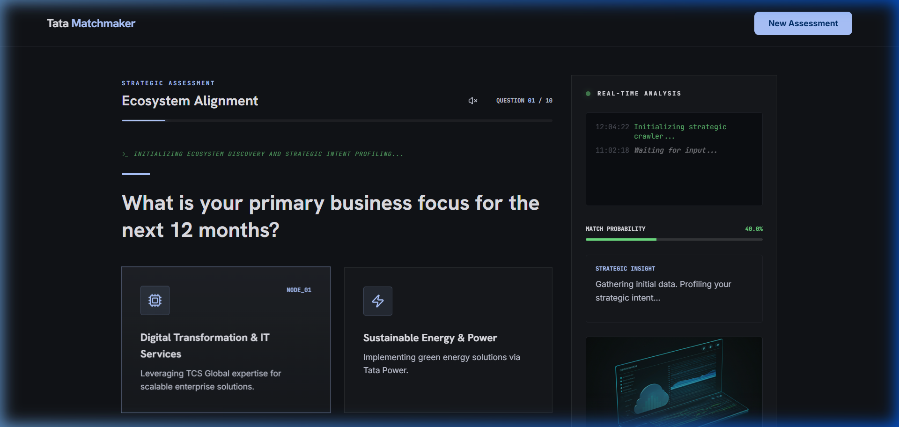

# Tata Matchmaker: AI-Powered Strategic Synergy Engine

A high-fidelity Next.js 14 application designed for the Tata Group to match business requirements with optimal ecosystem divisions.

## 🚀 Overview

**Tata Matchmaker** is a strategic alignment tool that leverages state-of-the-art AI (Gemini 2.0 Flash) to analyze enterprise needs and recommend the most compatible divisions within the Tata Group ecosystem. Whether you're looking for digital transformation via Tata Communications or industrial synergy with Tata Steel, this engine provides data-driven alignment through a dynamic, neural-reasoning pipeline.

## 📸 Screenshots

### Home Page

*The landing page featuring the Ecosystem Intelligence Engine.*

### AI Assessment & Neural Reasoning

*Interactive 10-step assessment with real-time AI reasoning visualization.*

## ✨ Key Features

- **Dynamic AI Quiz**: 10 adaptive questions that evolve based on your previous answers, powered by Gemini 2.0 Flash for deep strategic context.
- **Neural Reasoning Engine**: A real-time visualization sidebar that shows the AI's logic processing as it analyzes your business needs.
- **Professional Voice-Over**: Integrated text-to-speech providing a professional "Strategist" narration for an immersive executive experience.
- **Interactive Results Dashboard**: Comprehensive synergy mapping showing matches across Tata divisions (TCS, Tata Motors, Tata Digital, etc.).
- **Strategic Blueprint**: Detailed implementation roadmaps and ROI projections tailored to your enterprise goals.
- **Strategic PDF Export**: Generate and download professional, boardroom-ready PDF reports for executive review.

## 🛠️ Tech Stack

- **Frontend**: Next.js 14 (App Router)
- **Styling**: Tailwind CSS + Framer Motion (for high-fidelity animations)
- **AI/LLM**: Google Gemini 2.0 Flash (via OpenRouter)
- **Icons & UI**: Lucide React + Custom Glassmorphism Design System
- **Deployment**: Vercel

## 📖 How to Use

### 1. Prerequisites
- **Node.js 18+** installed on your system.
- An **OpenRouter API Key** (configured for Gemini 2.0 Flash access).

### 2. Installation
Clone the repository and install the necessary dependencies:
```bash
git clone <repository-url>
cd cloud-matchmaker
npm install
```

### 3. Environment Setup
Create a `.env.local` file in the root directory and add your OpenRouter API key:
```env
OPENROUTER_API_KEY=your_api_key_here
```

### 4. Running the Project
Launch the development server:
```bash
npm run dev
```
Open [http://localhost:3000](http://localhost:3000) in your browser to view the application.

### 5. Navigating the Assessment
1. **Start**: Click **"Start Assessment"** on the landing page.
2. **Interact**: Answer the 10 strategic questions. You can use the voice-over feature for an eyes-free experience.
3. **Analyze**: Monitor the **Neural Reasoning** sidebar to see how the AI is interpreting your scaling and operational needs.
4. **Review**: On the results page, explore your **Synergy Match Score** and specific division recommendations.
5. **Export**: Click **"Export Strategy"** to generate a downloadable PDF summary of your custom roadmap.

---
Built with precision for the **Tata Group Ecosystem**.
